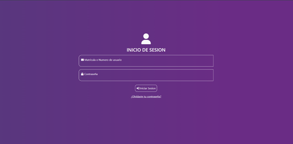
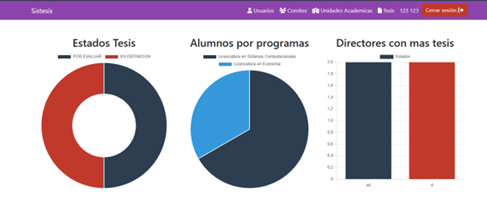
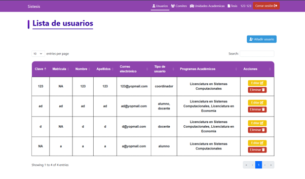
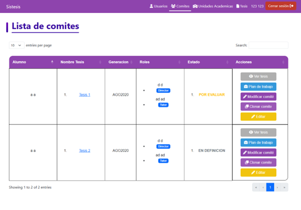
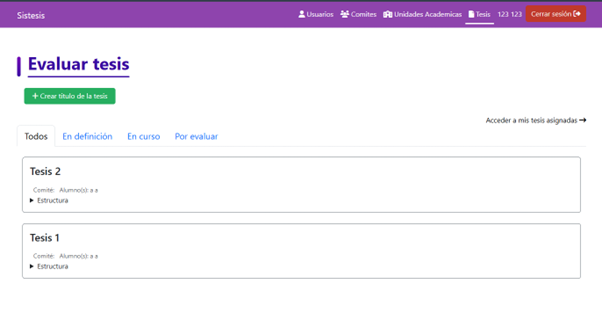
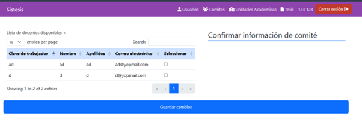
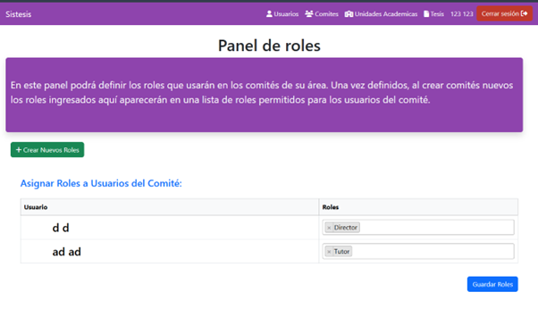
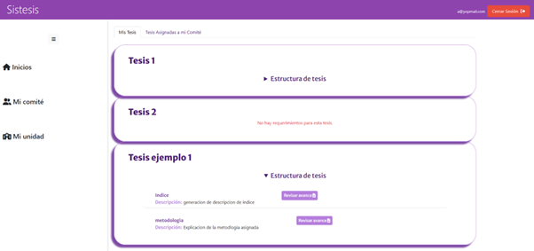
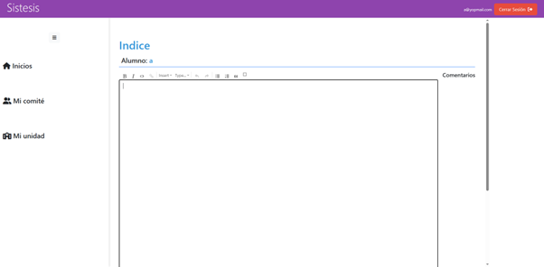

> **Spanish Version**: [Haz clic aquí para leer la versión en español de este README](README.md)


# [SISTESIS]

### Description
A comprehensive system for the management and monitoring of theses at the Autonomous University of Nayarit (UAN), specifically for the Academic Unit of Economics. This platform digitizes institutional processes and streamlines the management of student committees for thesis candidates.

### Technologies Used
This project was built with the following stack:
* **Backend:** PHP 8.x and Laravel 10.
* **Frontend:** JavaScript (ES6+), jQuery, Bootstrap 5.
* **Database:** MySQL (Designed in MySQL Workbench).
* **Package Management:** NPM and Composer.
* **Key Libraries:** ProseMirror, Chart.js, SweetAlert2, DataTables.

### Main Features
* **Thesis Management:** Complete workflow from thesis registration to final approval.
* **Statistical Dashboard:** Real-time data visualization using Chart.js for Department/Master's coordinators.
* **Rich Text Editor:** ProseMirror integration for detailed thesis descriptions and progress.
* **Role-Based Access Control (RBAC):** Authentication and specific permissions for Students, Faculty, and Administrators.
* **Dynamic Tables:** Fast filtering and searching powered by DataTables.
* **Password Recovery System:** Email-based password reset functionality.

### System Screenshots

**Figure 1: System Login**


---

**Figure 2: SISTESIS Dashboard for Coordinators**


---

**Figure 3: User Management**


---

**Figure 4: Committee Management**


---

**Figure 5: Thesis Tracking**


---

**Figure 6: Committee Member Assignment**


---

**Figure 7: Committee Role Assignment**


---

**Figure 8: Thesis Director Control Panel**


---

**Figure 9: Committee Member Thesis Visualization**


---

**Figure 10: Student Thesis View**


---

**Figure 11: Rich Text Editor for Thesis Progress**


---

### Installation and Configuration
To run this project locally, follow these steps:

1. **Clone the repository:**
   ```bash
   git clone [https://github.com/samiDroi/seguimientotesis.git](https://github.com/samiDroi/seguimientotesis.git)
   cd seguimientotesis
   2. **Instalar Dependencias**
   ```bash
   composer install

3. **Install Dependencies:**
   ```bash
   npm install 
   npm run build # o npm run dev si es para desarrollo activo

4. **Set Up Environment Variables:**
   ```bash
   cp .env.example .env
   php artisan key:generate

5. **Database Configuration:**
   Open the .env file in your text editor and update the following lines with your local MySQL credentials:
   
   ```env
    DB_CONNECTION=mysql
    DB_HOST=127.0.0.1
    DB_PORT=3306
    DB_DATABASE=your_db_name
    DB_USERNAME=your_username
    DB_PASSWORD=your_password
6. **Run migrations**
   ```bash
   php artisan migrate --seed